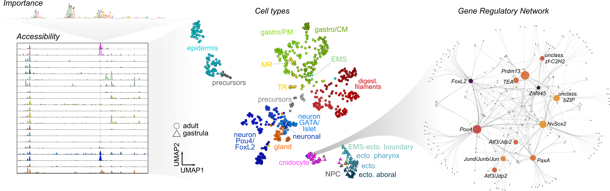

# Cnidarian chromatin accessibility and gene regulation 

This repository contains code for downstream analysis of _Nemtostella vectensis_ scATAC-seq data, including clustering and annotation, motif analysis, gene regulatory networks and sequence models.
 
