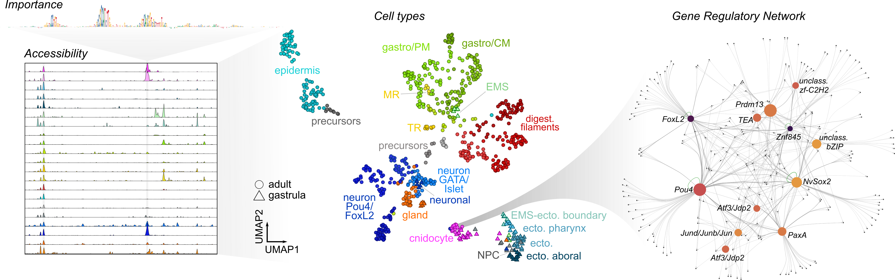

# Cnidarian chromatin accessibility and gene regulation 

This repository contains code for downstream analysis of _Nemtostella vectensis_ scATAC-seq data, including clustering and annotation, motif analysis, gene regulatory networks and sequence models.
 

# Code Overview

The code is organized into numbered notebooks and scripts that follow a logical progression from data processing to downstream analyses.

### Data Processing & Clustering
1. `01_ArchR_adult.qmd` and `01_ArchR_gastrula.qmd` - ArchR project setup for adult and gastrula scATAC-seq data
   - Cell filtering, doublet removal, dimensionality reduction
   - UMAP embedding and clustering using ArchR framework

2. `02_Integration.qmd` - Integration of adult and gastrula datasets
   - Joint analysis and harmonization of the two datasets
   - Cell type annotation and comparison across developmental stages

### Peak Analysis
3. `03_Peaks.qmd` - Joint peak calling and mapping
   - Identification of accessible chromatin regions across datasets
   - Peak-to-gene assignment and regulatory element annotation

4. `04_Metacell_mapping.qmd` - Metacell analysis
   - Mapping between scATAC and scRNA-seq metacells

### Motif Analysis
5. `05_Archetypes.qmd` & `05_Archetypes_JSD.ipynb` - Motif archetype analysis
   - Identification of regulatory motif patterns
   - Jensen-Shannon Divergence motif similarity analysis

6. `06_Motif_assignment.qmd` - Motif-to-TF assignment
   - Comprehensive motif enrichment analysis
   - Assignment of motifs to transcription factors

### Gene Regulatory Networks
7. `07_insilico_ChIP.qmd` - In silico ChIP-seq analysis
   - ChromVAR analysis for TF activity inference

8. `08_GRN.qmd` - Gene Regulatory Network construction
   - Integration of motif data with expression to build GRNs

### Advanced Analyses
9. `09_Cytoscape.ipynb` - Network visualization
   - Cytoscape-compatible network export and visualization

10. `10_Modules.qmd` - Gene module analysis
    - Identification of co-regulated gene modules

11. `11_gkmSVM.qmd` & `11_gkmSVM.ipynb` - Machine learning models
    - gkm-SVM classifiers for cell type prediction from sequence
    - Comprehensive Python notebook with 68 cells for model training/evaluation

12. `12_chromBPNet.qmd` - chromBPNet models
    - Training bias model and cell type-specific chromBPNet models

13. `13_CREsted_trained.ipynb`, `14_CREsted_eval.ipynb`, `15_CREsted_explain.ipynb` - crested model
      - Training, evaluation, and interpretation of crested models

14. `16_sPyce.ipynb` - cross-species scATAC integration
      - Integration with mouse data

### Visualization & Documentation
 `90_Figures.qmd` - Figure generation for publication
 `90_Genome_browser.ipynb` - Genome browser track preparation
 `90_Supplementary.qmd` - Supplementary analysis and figures

### Utility Functions
- `utils.py` - Python utilities for k-mer analysis and plotting
- `scripts/functions.py` - Additional Python helper functions
- `scripts/scatac_helper_functions.R` - R helper functions
- `scripts/chromvar_utils.R` - ChromVAR-specific utilities

### Specialized Functions
- `motif-analysis/` - Motif analysis functions
- `metacell_downstream_functions/` - Metacell analysis functions

### Interactive Applications
- `apps/scatac_atlas/` - Shiny app for interactive data exploration
- `apps/motif_syntax/` - Motif syntax visualization app
- `apps/trees/` - Phylogenetic tree visualization

### Processing Scripts
- `scripts/` - Various shell and R scripts for:
  - HOMER motif analysis
  - gkmSVM training/prediction
  - STREME motif discovery
  - H3K4me3 signal analysis

# Data Files

## Annotations and Genomes

The analysis makes use of the following genome and annotation files.

- Genome: `genome/Nvec_vc1.1_gDNA.fasta` (not on Gihub due to size, available from [NCBI](https://www.ncbi.nlm.nih.gov/datasets/genome/GCF_932526225.1/))

- Gene models: `genome/Nvec_v4_merged_annotation_sort.gtf.gz` and `genome/Nvec_v4_merged_annotation_sort.bed`  

- Gene annotations for all genes and transcription factors: `annotation/Nematostella_DToL_FINAL.tsv` and `annotation/Nematostella_DToL_TFs_FINAL.tsv`  

- GO functional annotations: `annotation/Nvec_ensembl.GO.rds` and `annotation/Nvec_ensembl.GO.csv`  

- PFAM annotations: `annotation/Nvec_long.pep.pfamscan_archs.csv`  

## Results

The analysis generates the following key resources listed below.

### Cell Type Annotations

- Cell type annotations and metacell mappings: `results/Clustering/Annotation_Adult_Gastrula_SEACell.tsv`

- Cell type-aggregated peak accessibility, adult and gastrula quantile normalized: `results/Clustering/Sum_Adult_Gastrula_Peaks_cell_type_qnorm.rds`  

- Cell type-aggregated peak accessibility fold changes , adult and gastrula quantile normalized: `results/Clustering/Footprint_Adult_Gastrula_Peaks_cell_type_qnorm.rds`  

- Cell type aggregated gene accessibility fold change: `results/GeneScoreMatrix/Matrix-Gene-Scores-cell-type-FC.rds`

- UMAP coordinates for metacells: `results/Clustering/SEACells_adult_gastrula_UMAP_FC3_gastrula_FC5_adult_qnorm.tsv`

### Motifs

- Archetype motifs PWMs: `results/Archetypes/motif-archetypes-PPM-PCC-0.8-IC0.5-5bp-pwms.*` 

- Dictionary mapping input motifs to archetypes: `results/Archetypes/motif-archetypes-PPM-PCC-0.8-IC0.5-5bp.dict`

- Archetype motif enrichments in cell types: `results/Archetypes/motif-enrichment-cell-type-archetypes-PPM-PCC-0.8-IC0.5-8bp-mona-*`

### Mapping of Motifs to TFs

- Motifs PWMs: `results/Motifs/motifs.meme` and `results/Motifs/motifs.rds`  

- Combined assignments of all motifs to TFs (left Euler diagram below): `results/Motifs/motif-assignment-combined.tsv.gz`  

- Selected one motif per TF gene (right Euler diagram below): `results/Motifs/motif-assignment-selected.tsv.gz`  

### Gene Regulatory Networks (GRNs)

- Global GRN: `results/GRN/global_grn.rds`

- GRNs per cell type `results/GRN/networks/cell_type` and broad cell type: `results/GRN/networks/broad_cell_type`
  - `grn_peaks_(cell_type|broad_cell_type)*` - GRNs linking TFs to target peaks
  - `grn_genes_(cell_type|broad_cell_type)*` - GRNs linking TFs to target genes
  - `grn_tfs_(cell_type|broad_cell_type)*` - GRNs linking TFs to target TFs 
  - `grn_tfs_info_*` - information about TFs in the GRNs (no links)

